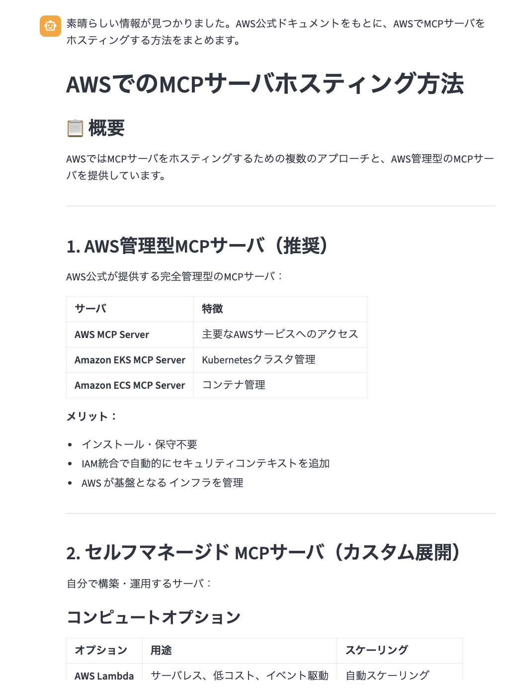
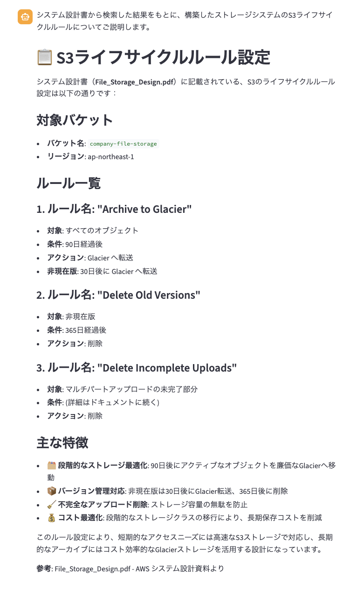

# rag-agentについて

AWS MCP Server 及び AWS Bedrock Knowledge Base を利用した AI Agent アプリです。
AWS Bedrock Knowledge Base は AWS Bedrock の RAG を構築する必要があるため、これを利用しない形でも実行可能です。
AWS MCP Server のみを利用する場合、AWS MCP ServerのtoolプリミティブをAgentを介してLLMに読み込ませ、文脈から必要なtoolを判断して実行します。
AWS MCP Server + AWS Bedrock Knowledge Baseの場合、上記と同様にtoolプリミティブを読み込むのはもちろんですが、Bedrockで構築したRAGのデータソース（今回はサンプルの設計書）をLLMに読み込ませ、文脈から必要なチャンクを抽出しつつ、MCP Server のtoolと連携して回答します。

| アプリ | ファイル |
|---|---|
| AWS MCP Server のみ | `app.py` 及び `agent.py` |
| AWS MCP Server + Knowledge Base | `app_with_kb.py` 及び `agent_with_kb.py` |

## 環境要件

- Python 3.13 以上
- [uv](https://docs.astral.sh/uv/getting-started/installation/)
- AWS アカウント（Bedrock へのアクセス権限が必要）

## セットアップ

### 1. リポジトリをクローン

```bash
git clone https://github.com/federermichael55/rag-agent.git
cd rag-agent
```

### 2. 依存パッケージをインストール

uv を利用：
```bash
uv sync
```
pyenv+venv+pip でも可能ですが、こちらでは割愛

### 3. 環境変数を設定

AWS 認証情報を環境変数に設定します：

```bash
export AWS_ACCESS_KEY_ID=your_access_key_id
export AWS_SECRET_ACCESS_KEY=your_secret_access_key
export AWS_SESSION_TOKEN=your_session_token
```

> `AWS_SESSION_TOKEN` は一時認証情報（AWS SSO や STS）を使う場合に必要です。

### 4. アプリを起動

---

#### ▶ AWS MCP Server のみ（`app.py`）

**UI モード：**
```bash
uv run streamlit run app.py
```

起動後、チャット欄に以下を入力して動作を確認してください：
```
AWSでMCPサーバをホスティングする方法を教えて
```
以下のような表示が出ればOK：


**API モード：**
```bash
uv run uvicorn api_server:app --host 0.0.0.0 --port 8000
```
以下のコマンドをターミナルから実行してUI版と同じ結果になればOK：
```bash
curl -X POST http://localhost:8000/chat \
  -H "Content-Type: application/json" \
  -d '{"message": "AWSでMCPサーバをホスティングする方法を教えて", "session_id": "test-001"}'
```

---

#### ▶ AWS MCP Server + Knowledge Base（`app_with_kb.py`）

> **事前準備：** AWS Bedrock Knowledge Base での RAG 構築が必要です（別途ガイド提供します）

**UI モード：**
```bash
uv run streamlit run app_with_kb.py
```

起動後、チャット欄に以下を入力して動作を確認してください：
```
システム設計書を参考に、構築したストレージシステムのS3のライフサイクルルールってどうなっているか教えて
```
以下のような表示が出ればOK：


**API モード：**
```bash
uv run uvicorn api_server_with_kb.py:app --host 0.0.0.0 --port 8000
```
以下のコマンドをターミナルから実行してUI版と同じ結果になればOK：
```bash
curl -X POST http://localhost:8000/chat \
  -H "Content-Type: application/json" \
  -d '{"message": "システム設計書を参考に、構築したストレージシステムのS3のライフサイクルルールってどうなっているか教えて", "session_id": "test-001"}'
```
